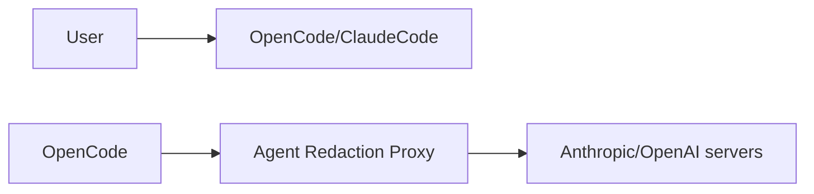

# Agent Redaction Proxy

A local proxy for OpenCode and Claude Code. It masks IPv4 addresses, recognizable credentials and user-defined sensitive strings before sending them to the model, then restores known markers in responses and tool arguments.

## Topology



## Quick start

1. Requires macOS/Linux.
2. Docker must be running.
3. OpenCode signed in with OpenAI OAuth.

```sh
cd ~/my-1-million-dollar-project
curl -fsSL https://raw.githubusercontent.com/hamza-cskn/AgentRedactionProxy/main/scripts/setup.sh | bash
opencode
```
---
To uninstall, run from the same project:

```sh
cd ~/project-i-dont-like
curl -fsSL https://raw.githubusercontent.com/hamza-cskn/AgentRedactionProxy/main/scripts/setup.sh | bash -s -- uninstall
```

Uninstall preserves the shared container and mapping data.

For Claude Code, Windows/Docker, or native Node.js setup, see [installation](docs/installation.md).

## Temporary bypass

Exit OpenCode and launch without protection:

```sh
ARP_BYPASS=1 opencode
```

A startup warning confirms bypass. Use a fresh conversation: bypass skips redaction and marker restoration. Exit and launch `opencode` normally to restore protection. Older installations need the [updated plugin](docs/installation.md#temporary-bypass-opencode).

## Optional protection

### Add your own sensitive strings

Place `user_defined_secrets.json` in the proxy's data directory—not your OpenCode project—and list the exact strings to redact:

```json
["passw0rd","nuclear-bomb-password","your \n certificate"]
```

Restart the proxy after changes. See [user-defined secrets](docs/configuration.md#your-own-sensitive-strings) for paths and validation rules.

### Encrypt your mappings

By default, ARP trusts your local machine and stores redaction-mappings and user-defined secrets in plaintext. To encrypt these files at rest, follow the [encryption guide](docs/encryption.md).

### Switch to paranoic mode

The shipped mode is `default`; strict `paranoic` mode favors security over stability. See [mode configuration](docs/configuration.md#configuration-configjson).

## Boundaries

Domain names, HTTP headers, opaque passwords and computed values (such as string concatenation) are outside detection scope. Placeholder/password ambiguity is deliberately unresolved. [Full limitations](docs/security.md).

Keep the proxy local and protect mapping files—they contain original sensitive values. Do not reset mappings while continuing old conversations.

## Documentation

- [Installation](docs/installation.md) — manual clients, installer behavior and bypass.
- [Configuration](docs/configuration.md) — modes, user-defined secrets and detection limits.
- [Encryption](docs/encryption.md) — encrypt existing storage and protect the master key.
- [Operations](docs/operations.md) — Docker, mapping recovery and tests.
- [Security and limitations](docs/security.md) — deliberate gaps and marker compatibility.
